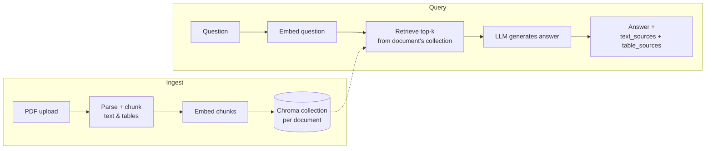

# Gandalf

A retrieval-augmented Q&A API for hardware datasheets. Upload a datasheet PDF, ask questions about it in plain English, and get answers grounded in the actual document — including its tables, which is where most naive RAG pipelines fall apart on this kind of content.

## Why hardware datasheets

Datasheets are a deliberately hard RAG target: electrical characteristics, pin definitions, and register maps live almost entirely in dense tables, not prose. A chunker that treats a datasheet like a blog post loses exactly the information an engineer would actually ask about ("what's the max operating voltage on pin PA0?"). Gandalf's ingestion path keeps table content distinct from text content end to end — the API returns `text_sources` and `table_sources` separately, so an answer can be traced back to whichever kind of chunk actually supported it.

## Architecture



Each uploaded document gets its own Chroma collection, keyed by a generated `document_id` — so documents are isolated from each other by construction, not by convention.

## Tech stack

- **API**: FastAPI, with blocking pipeline work (parsing, embedding, generation) offloaded via `run_in_threadpool` so the event loop stays responsive under concurrent requests
- **Vector store**: ChromaDB, one collection per document
- **Embeddings**: HuggingFace/sentence-transformers, model configurable via `EMBED_MODEL_NAME`
- **Generation**: an LLM API for answer synthesis — configured in `config.py` <!-- confirm provider/env var name -->
- **Evaluation**: [Ragas](https://docs.ragas.io) — faithfulness, answer relevancy, and context recall, scored against a hand-built question/answer set

## API reference

### `POST /documents`

Upload a PDF datasheet. Returns a `document_id` used for all subsequent queries against it.

```bash
curl -X POST http://localhost:8000/documents \
  -F "pdf=@stm32h753ii.pdf"
```

```json
{ "document_id": "kQ8f3xZpN2A" }
```

Rejects anything that isn't `application/pdf` or doesn't start with a valid `%PDF-` header.

### `POST /documents/{document_id}/query`

Ask a question about a previously uploaded document.

```bash
curl -X POST http://localhost:8000/documents/kQ8f3xZpN2A/query \
  -H "Content-Type: application/json" \
  -d '{"question": "What is the maximum operating voltage on pin PA0?"}'
```

```json
{
  "answer": "...",
  "text_sources": ["..."],
  "table_sources": ["..."]
}
```

Returns `404` if `document_id` doesn't correspond to an uploaded document.

## Evaluation

Answer quality is measured with Ragas rather than eyeballed. The harness:

1. Builds a labeled question/ground-truth set against a real ingested datasheet (`evaluation/dataset_builder.py`)
2. Scores each generated answer on **faithfulness** (is the answer supported by what was retrieved), **answer relevancy** (does it actually address the question), and **context recall** (did retrieval surface the information needed to answer at all) (`evaluation/ragas_runner.py`)
3. Checkpoints results incrementally to disk and aggregates mean scores per metric


Evaluated on the [STM32H753II](https://www.st.com/en/microcontrollers-microprocessors/stm32h753ii.html) datasheet.

## Getting started

```bash
git clone <repo-url>
cd gandalf
pip install -r requirements.txt
```

Create a `.env` file:

```
EMBED_MODEL_NAME=...
RAGAS_API_KEY=...          # evaluation only
# generation LLM key — see config.py
```

Run it:

```bash
uvicorn api:app --reload
```

## Project structure

```
gandalf/
├── app.py
├── api.py
├── config.py
├── schemas.py
├── requirements.txt
├── .env.example
│
├── ingestion/
│   ├── __init__.py
│   ├── parser.py                # PDF -> ParsedDocument (markdown + raw table cells), ONE doc handle
│   ├── header_resolver.py       # pure fn
│   ├── text_chunker.py          # markdown -> list[Chunk] (heading-aware + flat fallback)
│   └── table_chunker.py         # raw tables -> list[Chunk] (filter, resolve headers, serialize, row-split)
│
├── indexing/
│   ├── __init__.py
│   ├── embedder.py              # wraps sentence-transformers
│   └── vector_store.py          # wraps ChromaDB — ephemeral client, safe top-k built in
│
├── retrieval/
│   ├── __init__.py
│   └── retriever.py             # query -> RetrievalResult(text_chunks, table_chunks)
│
├── generation/
│   ├── __init__.py
│   ├── prompts.py                # system prompt + context formatting
│   └── llm_client.py             # openai SDK -> Groq endpoint; api_key passed per call, never stored
│
├── pipeline.py                  # RagPipeline — only cross-layer file
│
├── evaluation/
│   ├── __init__.py
│   ├── dataset_builder.py
│   └── ragas_runner.py
│
├── ui/
│   ├── __init__.py
│   ├── state.py                  # get_embedder() [app-wide cache] vs get_pipeline() [per-session]
│   └── components.py             # upload widget, chat rendering, source cards
│
├── utils/
│   ├── __init__.py
│   ├── logging_utils.py
│   └── file_utils.py             # tempfile save/cleanup for uploaded bytes
│
└── tests/
    ├── test_header_resolver.py
    ├── test_table_chunker.py
    ├── test_text_chunker.py
```

## Roadmap / known limitations

Being upfront about what's not finished yet, rather than letting it be found by surprise:

- **`context_precision` is currently disabled** in the eval harness (cost), so retrieval quality is only measured on recall, not on how well-ranked the retrieved chunks are.
- **No automated test suite yet.**
- **No upload size limit** on the PDF endpoint.
- **No live deployed demo yet** — currently local-only. <!-- update once deployed -->

## License

<!-- e.g. MIT — fill in -->